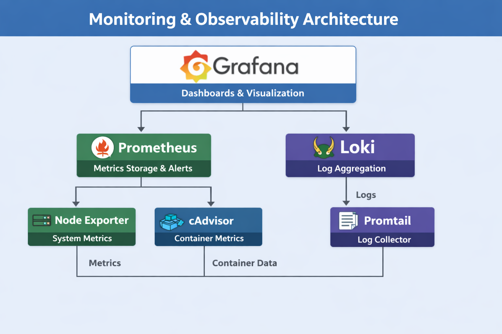

# 🚀 Monitoring & Observability Platform

Production-ready **Monitoring and Observability Stack** using Prometheus, Grafana, Loki, and exporters.
This project demonstrates how to build a **complete DevOps observability pipeline** for infrastructure and applications.

---

## 📌 Project Overview

This repository provides a **centralized monitoring solution** that enables:

* 📊 Metrics collection (Prometheus)
* 📈 Visualization dashboards (Grafana)
* 📜 Log aggregation (Loki + Promtail)
* ⚙️ System & container monitoring (Node Exporter, cAdvisor)
* 🚨 Alerting and incident visibility

Designed for:

* DevOps Engineers
* SREs
* Cloud Engineers

---

## 🏗️ Architecture

 
---

## ⚙️ Tech Stack

* **Prometheus** – Metrics scraping & alerting
* **Grafana** – Visualization & dashboards
* **Loki** – Log aggregation system
* **Promtail** – Log collector agent
* **Node Exporter** – Host-level metrics
* **cAdvisor** – Container metrics
* **Docker Compose** – Orchestration

Modern observability stacks combine metrics, logs, and visualization for full system visibility ([GitHub][1])

---

## 🚀 Getting Started

### 1️⃣ Clone the Repository

```bash
git clone https://github.com/josephmj0303/monitoring-and-observability.git
cd monitoring-and-observability
```

---

### 2️⃣ Start the Stack

```bash
docker-compose up -d --build
```

---

### 3️⃣ Access Services

| Service    | URL                   |
| ---------- | --------------------- |
| Grafana    | http://localhost:3000 |
| Prometheus | http://localhost:9090 |
| Loki       | http://localhost:3100 |

---

## 📊 Grafana Dashboards

Pre-configured dashboards include:

* System Metrics (CPU, Memory, Disk)
* Container Monitoring
* Application Metrics
* Log Visualization (Loki)

---

## 🚨 Alerting

Prometheus alert rules can be configured for:

* High CPU usage
* Memory pressure
* Container crashes
* Service downtime

Example alert rule:

```yaml
- alert: HighCPUUsage
  expr: 100 - (avg by(instance)(irate(node_cpu_seconds_total{mode="idle"}[5m])) * 100) > 80
  for: 2m
  labels:
    severity: critical
  annotations:
    summary: "High CPU usage detected"
```

---

## 📜 Logging with Loki

* Centralized logging using **Loki**
* Logs collected via **Promtail**
* Query logs directly in Grafana using LogQL

---

## 🧪 Load Testing (Optional)

```bash
bash scripts/load-test.sh
```

Simulates traffic to visualize metrics and logs in real time.

---

## 📂 Repo Structure

```
monitoring-and-observability/
│
├── architecture/
│   └── monitoring-architecture.png
│
├── docker/
│   ├── prometheus/
│   │   └── prometheus.yml
│   │
│   ├── grafana/
│   │   ├── dashboards/
│   │   └── datasources/
│   │
│   ├── loki/
│   │   └── loki-config.yaml
│   │
│   └── promtail/
│       └── promtail-config.yaml
│
├── exporters/
│   ├── node-exporter/
│   ├── cadvisor/
│   └── app-metrics/
│
├── scripts/
│   ├── setup.sh
│   ├── cleanup.sh
│   └── load-test.sh
│
├── docs/
│   ├── setup-guide.md
│   ├── dashboards.md
│   ├── alerting.md
│   └── troubleshooting.md
│
├── docker-compose.yml
├── .env
├── README.md
└── LICENSE
```

---
## 🔐 Security Best Practices

* Use `.env` for credentials
* Enable authentication in Grafana
* Restrict Prometheus endpoints
* Use reverse proxy (NGINX) for production

---

## 📈 Future Improvements

* Kubernetes deployment (Helm charts)
* Alertmanager integration
* Distributed tracing (Jaeger / Tempo)
* CI/CD integration

---

## 👨‍💻 Author

Portfolio Project

DevOps Engineer | Cloud | Observability
