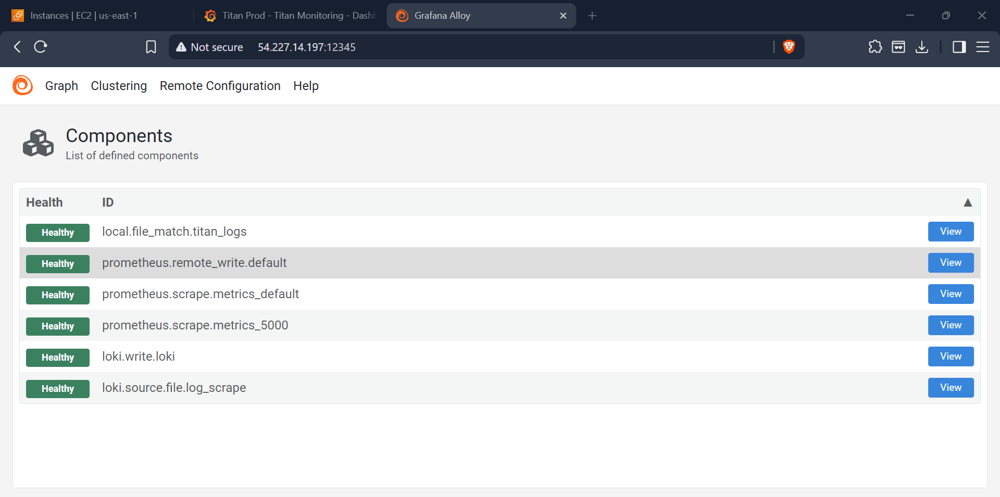
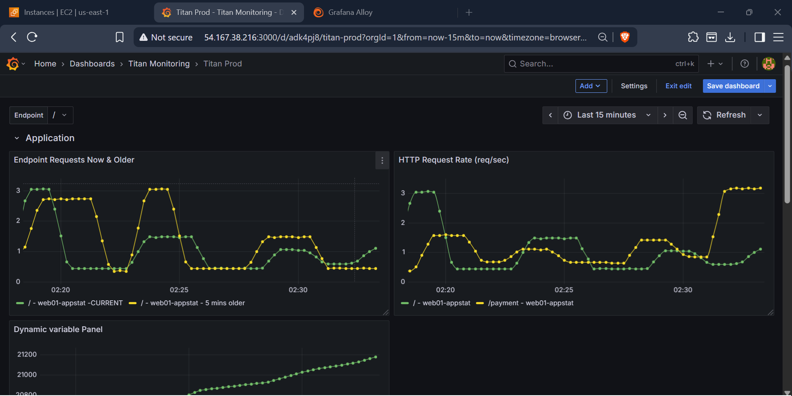
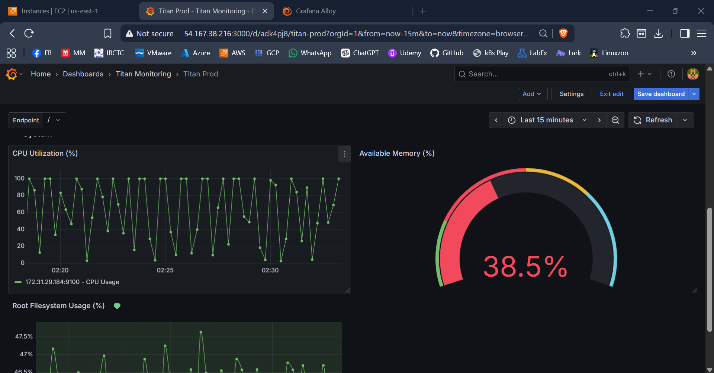
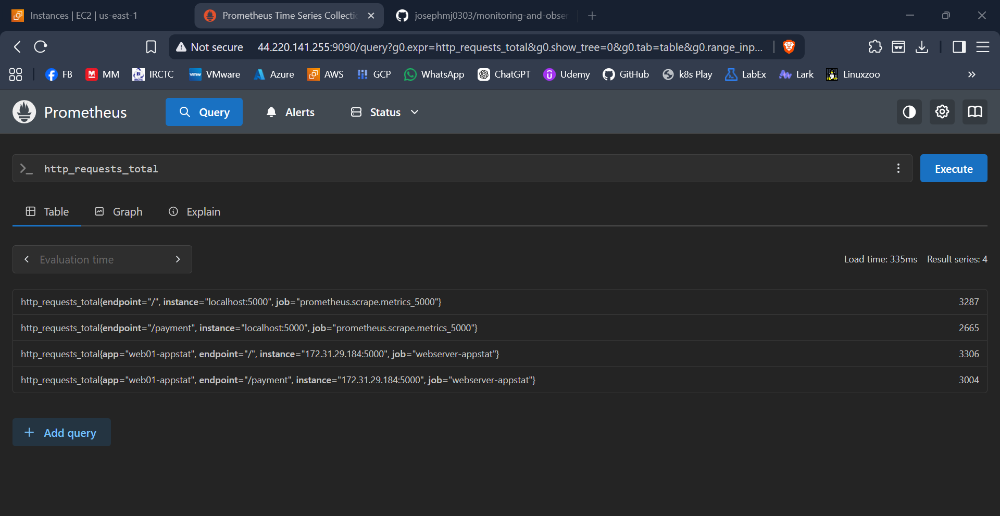
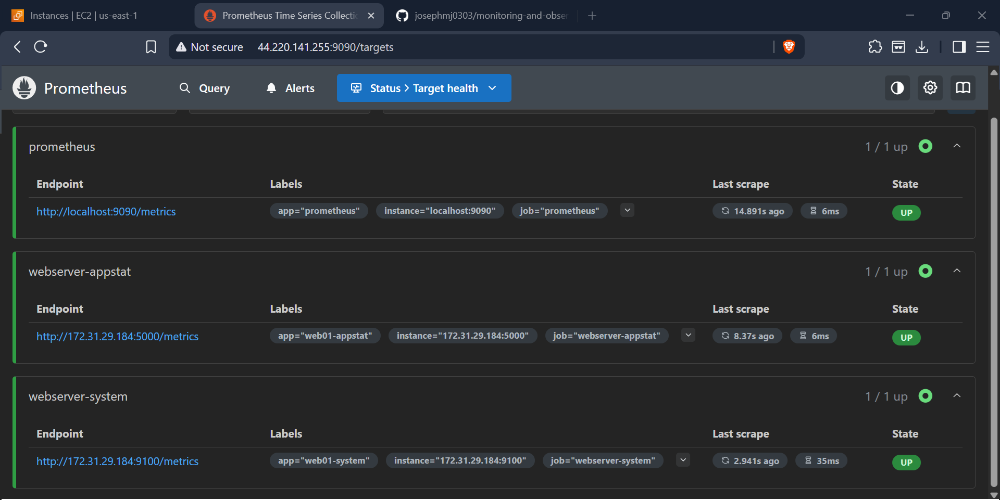
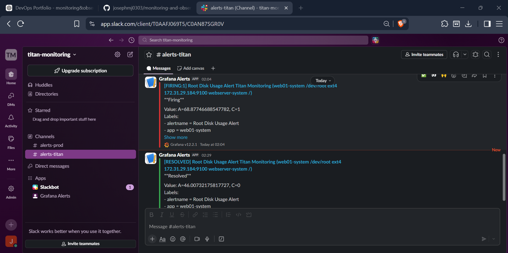

# 🚀 Monitoring & Observability Platform (VM-Based)


Production-ready **Monitoring & Observability Stack on EC2** using Prometheus, Grafana, Loki, and Grafana Alloy.

This project demonstrates **real-world observability**, using:

* VM-based deployment
* Systemd services
* Centralized logging & metrics pipeline

---

## 📌 Project Overview

This platform provides **end-to-end observability** for a Python Flask application running on a Linux server.

### 🔍 Key Capabilities

* 📊 Metrics collection via **Node Exporter & Alloy**
* 📈 Visualization using **Grafana**
* 📜 Centralized logging with **Loki**
* ⚙️ Python Flask app monitoring
* 🚨 Alerting with **Prometheus + Slack**
* 🔄 Load simulation for real-time insights

---

## 🏗️ Architecture

### 📊 Observability Flow


### 🌐 Network & Ports


---

## ⚙️ Tech Stack

| Component     | Purpose                      |
| ------------- | ---------------------------- |
| Prometheus    | Metrics storage & alerting   |
| Grafana       | Visualization dashboards     |
| Loki          | Log aggregation              |
| Grafana Alloy | Metrics + Logs collector     |
| Node Exporter | System metrics               |
| Python Flask  | Application under monitoring |
| Slack         | Alert notifications          |
| Systemd       | Service management           |

---

## 🖥️ Infrastructure Setup

### 🧱 EC2 Instances

| Instance       | Role                              |
| -------------- | --------------------------------- |
| App EC2        | Flask app + Alloy + Node Exporter |
| Prometheus EC2 | Metrics storage                   |
| Grafana EC2    | Dashboards                        |
| Loki EC2       | Log aggregation                   |

---

## 🔁 Data Flow

1. **Node Exporter** → System metrics
2. **Flask App** → `/metrics` endpoint
3. **Alloy Agent**

   * Scrapes metrics
   * Pushes to Prometheus (remote_write)
   * Collects logs → pushes to Loki
4. **Prometheus**

   * Stores metrics
   * Sends alerts
5. **Grafana**

   * Queries Prometheus & Loki
6. **Slack**

   * Receives alerts from Alertmanager

---

## 🚀 Setup Instructions

### 1️⃣ Clone Repository

```bash
git clone https://github.com/josephmj0303/monitoring-and-observability.git
cd monitoring-and-observability
```

---

### 2️⃣ Setup Application Node

Run the full setup script:

```bash
chmod +x webnode-setup.sh
sudo ./webnode-setup.sh
```

This installs:

* Node Exporter (port 9100)
* Python Flask App (systemd service)
* Grafana Alloy
* Load generators
* Logging pipeline

---

### 3️⃣ Configure Alloy

Update endpoints in:

```bash
/etc/alloy/config.alloy
```

Replace:

```
PrometheusIP → Your Prometheus EC2 IP
LokiIP       → Your Loki EC2 IP
```

---

### 4️⃣ Access Services

| Service       | Port  |
| ------------- | ----- |
| Flask App     | 5000  |
| Node Exporter | 9100  |
| Alloy UI      | 12345 |
| Prometheus    | 9090  |
| Grafana       | 3000  |
| Loki          | 3100  |

---

## 📊 Metrics Collection

* Node-level metrics via Node Exporter
* App metrics via `/metrics` endpoint
* Alloy handles scraping and forwarding

---

## 📜 Logging Pipeline

* Logs stored at: `/var/log/titan/*.log`
* Alloy collects logs
* Pushes to Loki
* Queried via Grafana (LogQL)

---

## 🚨 Alerting (Slack Integration)

Prometheus Alertmanager is configured to send alerts to Slack.

### Example Alerts

* High CPU usage
* App downtime
* Memory spikes

---

## 🧪 Load Testing

Simulate traffic:

```bash
/usr/local/bin/load.sh
/usr/local/bin/generate_multi_logs.sh
```

This helps visualize:

* Metrics spikes
* Log ingestion
* Alert triggering

---

## 🔐 Security & Networking

* UFW Firewall configured

* Allowed ports:

  * 22 (SSH)
  * 5000 (App)
  * 9100 (Node Exporter)
  * 3100 (Loki)
  * 12345 (Alloy)

* Grafana access restricted to Admin/VPN

---

## 📂 Project Structure

```
monitoring-and-observability/
│
├── architecture/
│   ├── monitoring-architecture.png
│   └── port-numbers.png
│
├── app/
│   └── titan/
│       ├── app.py
│       ├── requirements.txt          
│       ├── index.html
│       ├── payment.html
│       ├── images/
│       ├── tooplate-titan-script.js
│       ├── tooplate-titan-style.css
│       └── ABOUT THIS TEMPLATE.txt
│
├── observability/
│   ├── alloy/
│   │   ├── config.alloy              
│   │   └── defaults.env              
│   │
│   ├── prometheus/
│   │   └── prometheus-setup.sh
│   │
│   ├── grafana/
│   │   └── grafana-setup.sh
│   │
│   ├── loki/
│   │   └── loki-setup.sh            
│   │
│   └── promtail/
│       └── promtail-config.yml
│
├── scripts/
│   ├── webnode-setup.sh              
│   ├── load.sh
│   ├── generate_multi_logs.sh
│   ├── website-test-main.sh          
│   └── website-test-payment.sh       
│
├── infra/
│   └── terraform/
│       ├── main.tf
│       ├── variables.tf
│       ├── outputs.tf
│       ├── provider.tf
│       └── terraform.tfvars
│
├── .github/
│   └── workflows/
│       └── terraform.yml
│
├── docs/
│   ├── setup-guide.md
│   ├── architecture.md
│   ├── alerting.md
│   └── troubleshooting.md
│
├── screenshots/
│   ├── grafana-dashboard-app.png
│   ├── grafana-dashboard-system.png
│   ├── alloy-dashboard.png
│   ├── prometheus-query.png
│   └── prometheus-targets.png
│
├── .gitignore
├── README.md
└── LICENSE
```
---

## 📸 Screenshots

Alloy-Dashboard


Grafana-app-Dashboard


Grafana-system-Dashboard


Prometheus-Query


Prometheus-Targets


Slack-Alerts



---

## 📈 Key Highlights 

* Built **VM-based observability stack**
* Implemented **Grafana Alloy for unified pipeline**
* Configured **remote_write metrics architecture**
* Designed **centralized logging system**
* Integrated **Slack alerting**
* Simulated real-world traffic for monitoring validation

---

## 🔮 Future Enhancements

* TLS/HTTPS setup
* Grafana authentication hardening
* Multi-node scaling
* Kubernetes migration (optional)
* Tempo (distributed tracing)

---

## 👨‍💻 Author

DevOps Portfolio Project

DevOps Engineer | Cloud | Observability
