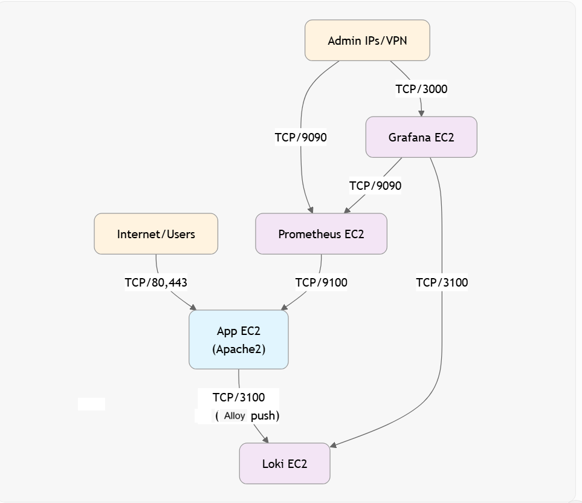

# 🏗️ Architecture Overview

This project implements a **VM-based observability architecture** using Prometheus, Grafana, Loki, and Grafana Alloy.

---

## 📊 High-Level Architecture

---

## 🌐 Network Flow

---

## 🔁 Data Flow Explanation

### 📊 Metrics Pipeline

1. Node Exporter exposes system metrics (port 9100)
2. Flask app exposes `/metrics`
3. Grafana Alloy:

   * Scrapes metrics
   * Sends via `remote_write` to Prometheus
4. Prometheus stores metrics
5. Grafana visualizes data

---

### 📜 Logs Pipeline

1. Flask app writes logs → `/var/log/titan/*.log`
2. Alloy reads logs
3. Pushes logs to Loki
4. Grafana queries logs via Loki

---

## 🧠 Key Design Decisions

### ❌ No Docker / Containers

* Real-world VM-based deployment
* Systemd services used instead

### ✅ Grafana Alloy

* Unified agent for logs + metrics
* Replaces Promtail + exporters complexity

### ✅ Remote Write Architecture

* Scalable metrics pipeline
* Decouples app from Prometheus

---

## 🖥️ Components Breakdown

| Component     | Role                         |
| ------------- | ---------------------------- |
| Flask App     | Application under monitoring |
| Node Exporter | System metrics               |
| Alloy         | Metrics + logs collector     |
| Prometheus    | Metrics storage              |
| Loki          | Log storage                  |
| Grafana       | Visualization                |

---

## 🔐 Security Design

* Firewall (UFW) configured
* Grafana restricted access
* Internal communication via private IPs

---

## 📈 Scalability Considerations

* Multiple app nodes can push to same Prometheus
* Loki supports horizontal scaling
* Grafana supports multiple data sources

---

## 🚀 Summary

This architecture demonstrates a **production-style observability system** using:

* Centralized logging
* Metrics aggregation
* Alerting pipelines
* Real application monitoring

